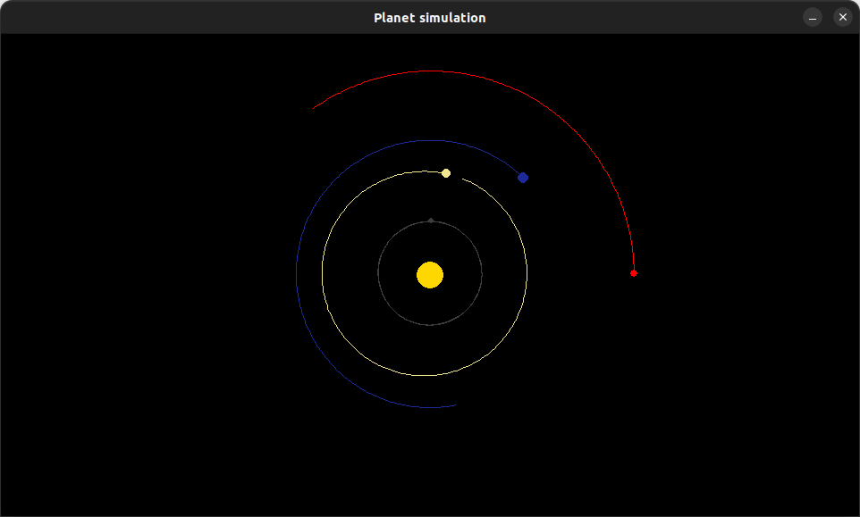

# Planet Simulator :ringed_planet:
This repository is a challenge I've given myself. I watched [this video](https://youtu.be/WTLPmUHTPqo) a couple months back and managed to get a functional game. After a long break from python, I've decided to recreate this simulation without consulting the video. In other words, I'm challenging myself to code a similar simulator without help.

## to run :computer:
To run the simulation make sure you have Python and the Pygame module installed. If you don't have Python you can follow [this tutorial](https://realpython.com/installing-python/#how-to-install-on-ubuntu-and-linux-mint). If you don't Pygame, simply run the ``pip install pygame`` command in your terminal. Once it's all set up, you can download this repository with ``git clone https://github.com/KasraRahimi/planet-simulator.git``. Once everything is set up, you can run the game by running the game.py file.

## screenshot of the game
A screenshot of the game can be found below, to help visualize what the simulation looks like.

